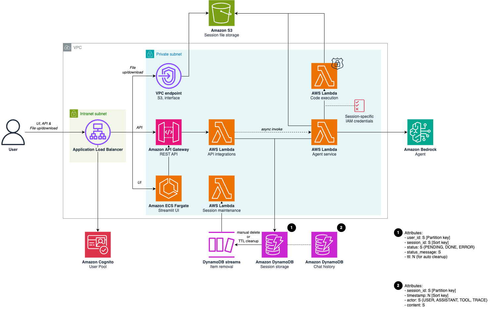
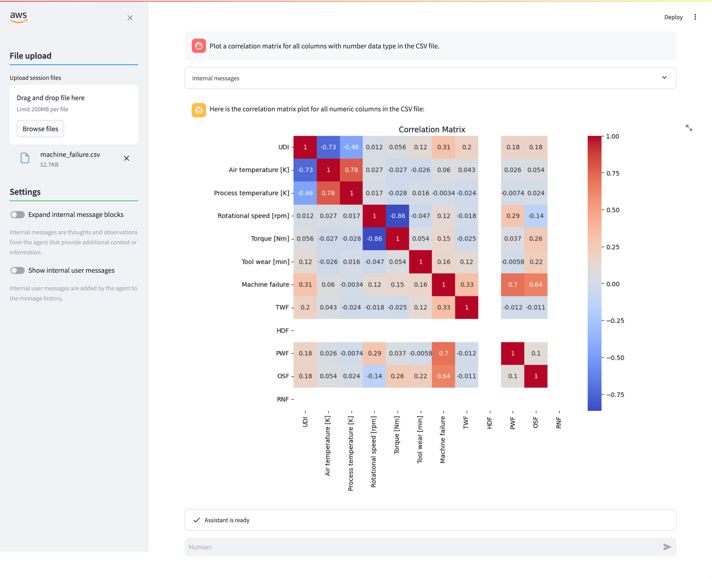
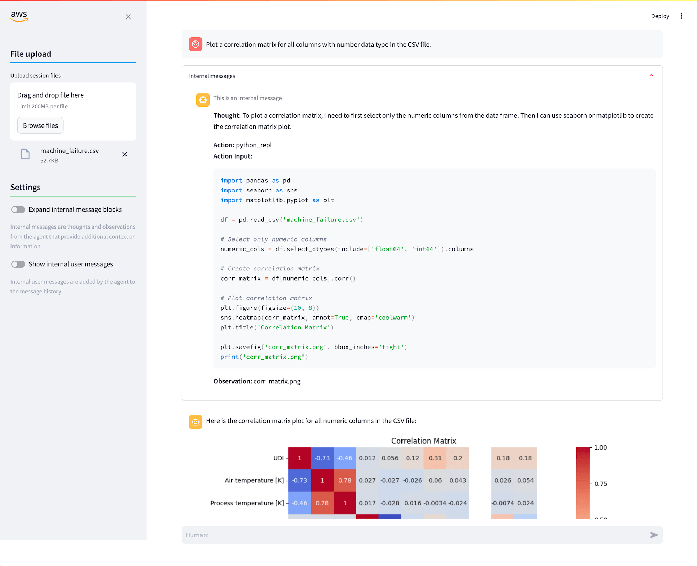
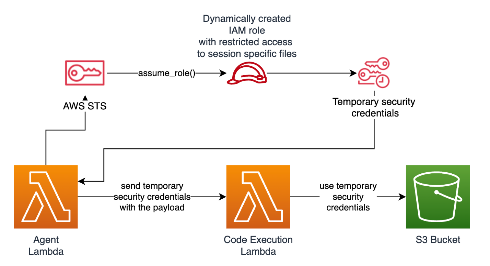

<!--
 Copyright Amazon.com, Inc. or its affiliates. All Rights Reserved.
 SPDX-License-Identifier: MIT-0
-->

# 🤖 No-Code Generative AI Data Analytics Solution on AWS

Transform your data analysis workflow with this powerful no-code generative AI solution. This repository provides a reference architecture that puts the power of AI-assisted analytics in your hands.

This repository accompanies the AWS blog post [BMW Group fosters data-driven culture with a no-code generative AI data analytics solution on AWS](https://aws.amazon.com/blogs/industries/bmw-group-fosters-data-driven-culture-with-a-no-code-generative-ai-data-analytics-solution-on-aws/). It shows an abstracted reference implementation of the solution.

## ✨ What Makes This Special

This application serves as your intelligent code interpreter, automatically generating and executing code based on natural language prompts.

The solution leverages [Amazon Nova](https://aws.amazon.com/ai/generative-ai/nova/) foundation models on Amazon Bedrock for advanced reasoning, while maintaining enterprise-grade security. The full solution is hosted in a your own Amazon Virtual Private Cloud (VPC).

## 🏗️ Architecture Overview


*Architecture Diagram*

The solution runs in its own VPC with a carefully designed security architecture. It relies on AWS serverless components (Lambda, API Gateway, DynamoDB, etc.) for handling the requests, while Amazon Bedrock is used for foundation models and agent capabilities.

### 🔑 Key Components and Responsibilities

1. **Application Load Balancer (ALB)**: Distributes incoming application traffic across multiple targets.
2. **API Gateway (REST API)**: Acts as the front door for the application and provides API endpoints, for uploading and downloading files, and to interact with the Agent service.
3. **Amazon ECS Fargate (Streamlit UI)**: Hosts the Streamlit UI for users to interact with.
4. **Amazon Cognito**: An Amazon Cognito user pool manages authentication.
5. **AWS Lambda (API Integrations)**: Implements the API endpoints exposed by the API Gateway.
6. **AWS Lambda (Agent service)**: Manages chat sessions, orchestrates the Amazon Bedrock Agent, handles return-control steps, and invokes the Code execution Lambda function using temporary limited credentials for executing the foundation model-generated code.
7. **AWS Lambda (Code Execution)**: Executes the code generated by the Agent in an isolated environment with restricted access, ensuring security. This Lambda function is Docker-based due to the size of required dependencies.
8. **AWS Lambda (Session Maintenance)**: Cleans user files and the chat messages for user sessions.
9. **Amazon S3**: Used for session file storage: it contains the files uploaded by the user and the files generated by code execution steps.
10. **Amazon DynamoDB (Session Storage & Chat History)**: Stores session data as well as chat messages from user and assistant.
11. **Amazon Bedrock Agent**: Provides the ReAct loop Agent and foundation model capabilities.

## 🖥️ User Interface

This example ships with a simple demo UI based on Streamlit which gets deployed as part of the stack to Amazon ECS Fargate.





## 🚀 Getting Started

### Prerequisites

- Active AWS account
- [Hosted zone in Amazon Route 53](https://docs.aws.amazon.com/Route53/latest/DeveloperGuide/hosted-zones-working-with.html) for your domain
- Valid TLS certificate for your domain in Amazon Certificate Manager
- Optional: VPC configuration with 2 public and 2 private subnets (this can optionally be created as part of the example IaC)

### Deploy

This example uses Terraform to manage Infrastructure as Code (IaC).

Some environment variables need to be adapted and configured from `terraform/example.tfvars`. As for the VPC, you can either choose to deploy the example into your own VPC (then you need to set the `vpc_config` parameters in the configuration file) or you can have an exemplary VPC created for you by setting `create_vpc = true`

1. Clone this repository
2. Customize `terraform/example.tfvars` for your environment and store as `my-environment.tfvars`
3. Deploy with Terraform:

    ```bash
    cd terraform
    terraform plan -var-file=my-environment.tfvars
    terraform apply -var-file=my-environment.tfvars
    ```

The UI URL and demo user login credentials are returned as outputs from Terrafrom. You can view them as follows:

```bash
# Streamlit URL
terraform output streamlit_url

# Demo user credentials
terraform output demo_user
```

## 🤓 Implementation details

### 👤 User Flow

1. **User Access**
   - The user accesses the application via a web browser (Streamlit UI) or the REST API exposed by the application. You can view the API specification [here](./terraform/resources/open_api_spec.tmpl)
   - Requests from the user are directed to the Application Load Balancer (ALB), which distributes the traffic to the API Gateway, the Streamlit UI, and the VPC endpoint for S3.

2. **Authentication**
   - User authentication is handled by an [Amazon Cognito user pool](https://docs.aws.amazon.com/cognito/latest/developerguide/cognito-user-pools.html). It is implemented via the Application Load Balancer using OIDC, ensuring secure login and user identity verification.

3. **API Gateway**
   - The API Gateway receives the requests and routes them to the API Integrations Lambda function.

4. **Backend Processing**
   - The API Integrations Lambda triggers the Agent Lambda to handle the chat session. This Agent Lambda, in turn, invoke the Code Execution Lambda function asynchronously to securely execute the generated code in an isolated environment. Once the code is executed and the output is provided, control is sent back to the Agent Lambda. The Agent Lambda then stores the response in the Chat History DynamoDB table and updates the session status in the Session Storage DynamoDB table.

5. **File Storage**
   - For session-related files, the API Integrations Lambda function interacts with Amazon S3 using pre-signed URLs to store or retrieve files as needed. This pattern presents a serverless solution for securely interacting with S3 objects by using presigned URLs from a private network without internet traversal. Learn more about this solution [here](https://docs.aws.amazon.com/prescriptive-guidance/latest/patterns/set-up-private-access-to-an-amazon-s3-bucket-through-a-vpc-endpoint.html).

6. **Data Cleanup**
   - DynamoDB Streams Item Removal handles the cleanup of DynamoDB entries through automatic TTL expiration.

### ☁️ Private VPC setup

For session file storage and exchanges between the user and agent, the solution uses Amazon S3. The Amazon S3 bucket is configured to only be accessible from the through a VPC endpoint (this solution is described [here](https://docs.aws.amazon.com/prescriptive-guidance/latest/patterns/set-up-private-access-to-an-amazon-s3-bucket-through-a-vpc-endpoint.html), with a reference implementation [here](https://github.com/aws-samples/private-s3-vpce)). To interact with the Amazon S3 bucket, clients use the REST API, which will issue pre-signed upload and download URLs to authorized users. The application load balancer is configured with rules to route Amazon S3–related requests for upload and download directly to the Amazon S3 VPC endpoint.

### 📝 Runtime isolation of Fondation Model-generated Python code

To securly run foundation model-generated code, a dedicated AWS Lambda function has been created. This AWS Lambda function operates without network access (with an exception for the Amazon S3 bucket to exchange session files) and can only use a predefined set of Python packages, which are preinstalled in its environment. This setup helps verify that any malicious code requiring external packages or resources will fail.

Another layer of security is provided by the use of short-lived credentials with session policies associated with the Code Execution AWS Lambda function. By default, the Code Execution AWS Lambda function has attached the `AWSLambdaBasicExecutionRole`. The Code Execution environment needs access to be able to read files provided by the user and provide files back to the user. Specifically, such files are exchanged through the Amazon S3 bucket. Permissions are temporarily granted using a short-lived credentials mechanism that allows access only to files related to the current session. Here, the Agent AWS Lambda function uses the AWS STS `AssumeRole` action to assume a specific IAM role with Amazon S3 access. It attaches a session policy that narrows down the Amazon S3 access to the specific Amazon S3 prefix relevant for a session and then obtains the assumed role’s credentials (AccessKeyId, SecretAccessKey, SessionToken). The credentials are then passed by the Agent AWS Lambda function to the Code Execution AWS Lambda function.


*Code Runtime Isolation Diagram*

Below is an example of the session policy that will dynamically be created by the Agent Lambda function for each session at runtime.

```json
{
    "Version": "2012-10-17",
    "Statement": [
        {
            "Effect": "Allow",
            "Action": ["s3:GetObject", "s3:PutObject"],
            "Resource": "arn:aws:s3:::<FILE_STORAGE_BUCKET_NAME>/sessions/<SESSION_ID>/*"
        },
        {
            "Effect": "Allow",
            "Action": "s3:ListBucket",
            "Resource": "arn:aws:s3:::<FILE_STORAGE_BUCKET_NAME>",
            "Condition": {
                "StringLike": {"s3:prefix": "sessions/<SESSION_ID>/*"}
            }
        },
        {
            "Effect": "Allow",
            "Action": ["kms:Decrypt", "kms:GenerateDataKey"],
            "Resource": "<FILE_STORAGE_BUCKET_KMS_KEY_ARN>"
        }
    ]
}
```
